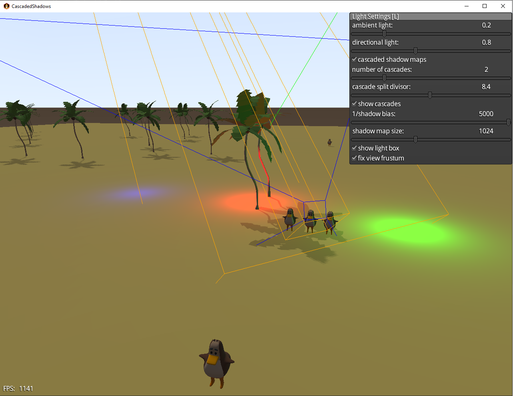

# CascadedShadows

Test of cascaded shadows on different platforms.

A [libGDX](https://libgdx.com/) project generated with [gdx-liftoff](https://github.com/libgdx/gdx-liftoff).

To get CSM working on web: Use the latest snapshot of gdx-gltf (as of June 3rd, 2024) by having the following line in gradle.properties:

        gdxGltfVersion=-SNAPSHOT

Light settings menu:

This programme demonstrates how cascaded shadows work in practice and how they can remedy shadow artifacts.

- On startup the camera will rotate automatically around the origin. 
- Use LMB to activate the camera controller to move the camera with the mouse.
- Press RMB to start the automatic rotation again.
- Zoom in and out with the mouse wheel.  

The Light settings menu can be opened and closed with the L button.

- the main shadow box is shown as a green wire frame box.  The light source and its direction is shown at the centre of the near plane.
- cascade shadows boxes are shown as orange boxes inside the green box. The relative sizes of the orange boxes is determined by the split divisor.
- You can freeze the current view (fix view frustum) which shows the viewing frustum of the perspective camera as a blue wire frame.

- When CSM is enabled, the green box will be sized to fit around the blue frustum.  The cascades (orange boxes) will be sized to fit around the 
- narrowest part of the blue frustum. This is to give sharper shadows near the camera using the smaller cascades.

- If CSM is not enabled, the shadow box can be sized with the sliders (viewport size, near far). The box is always centred on the origin. 

Specific gradle.properties (changed from liftoff defaults):
- gdxGltfVersion=-SNAPSHOT
- gdxTeaVMVersion=-SNAPSHOT
- teaVMVersion=0.9.2

## Platforms

- `core`: Main module with the application logic shared by all platforms.
- `lwjgl3`: Primary desktop platform using LWJGL3.
- `html`: Web platform using GWT and WebGL. Supports only Java projects.
- `teavm`: Experimental web platform using TeaVM and WebGL.
